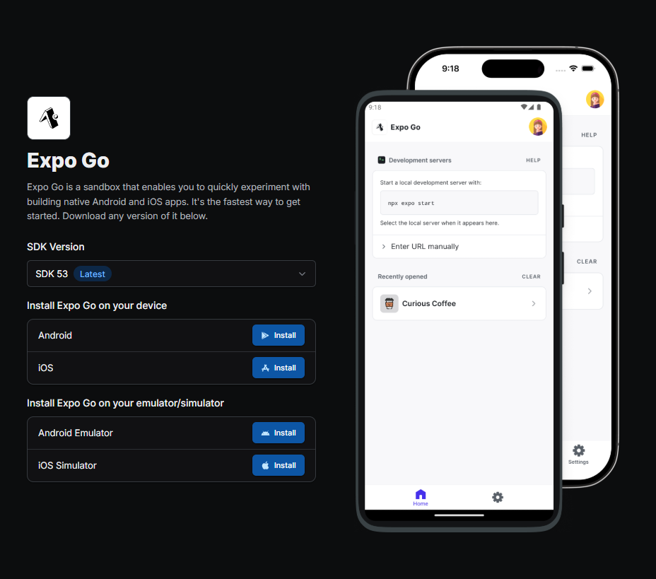
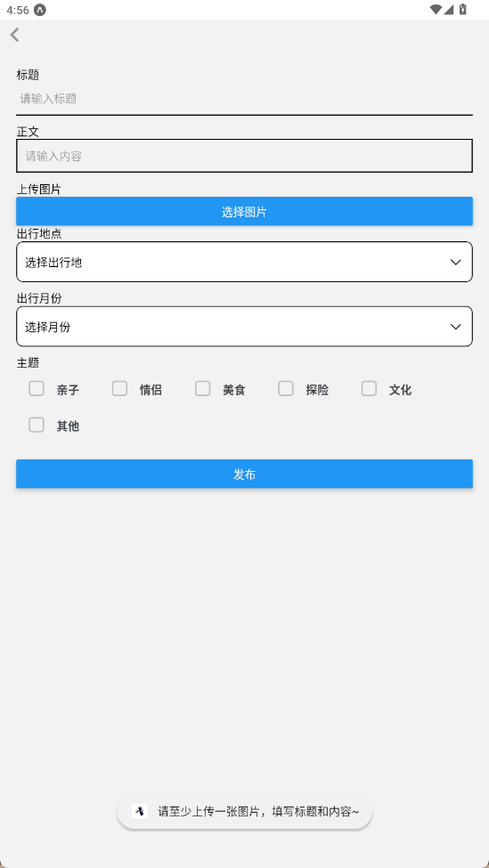

# 携程训练营大作业 -- Trail-Tales游记平台
## 项目介绍
项目分为游记发布、呈现的用户系统和内容合规检查的审核管理系统。其中对客用户使用的游记发布系统为一个移动端项目，可以在手机端发布游记以及查看、分享所有已成功发布的游记；审核管理系统为一个 PC 站点，不同角色可以对用户发布的游记做上线前的审核检查、删除等操作。<br><br>
仓库中的项目代码分为三个子模块，其中**移动端对应`trail-tales-app`**，**PC审核端对应`PC-management-system`**，**后端服务器及数据库搭建对应`back-end`**
## 环境配置
- ### 移动端<br>
  技术栈：React Native、Nodejs<br><br>
  1、 app使用expo沙盒环境搭建，初始化命令如下，在本项目中只需使用`npm install`命令安装依赖即可使用<br>
  ```
  npx create-expo-app trail-tales-app
  ```
  2、 app运行需要结合**Expo Go**软件来查看界面，可以选择真机以及模拟器两种方式打开，具体安装步骤可到官网上查看，下载时要与使用的expo沙盒环境的版本相对应<br>
  
- ### PC审核端<br>
  技术栈：React Native、Nodejs<br><br>
  1、 审核端初始化命令如下，在本项目中只需使用`npm install`命令安装依赖即可使用<br>
  ```
  npx create-react-app PC-management-system
  ```
  2、 审核端登陆界面不提供注册功能，需要在后端运行`initManger.js`来初始化审核账号，建议初始化时创建超级管理员账号，在审核页面中会根据当前登录账号的权限提供不同的新建账号功能
- ### 后端<br>
  技术栈：Nodejs<br><br>
  后端服务器使用Nodejs搭建，数据库使用Mongodb数据库，项目运行时将其部署在本地，数据库的使用可以到官网上查看，前期需要在后端向数据库写入审核端所需的账号信息
  ```
  node initManger.js   // 写入管理员信息
  node server.js      // 运行后端服务器
  ```
## 页面设计
### app页面设计
- 首页（游记列表页）：该页面不验证用户的登录状态，通过审核的游记会以瀑布流的形式展示对应的游记卡片，点击卡片会进入到游记详情页，可以通过上方的搜索栏或主题挑选喜欢的游记展示<br>


- 游记详情页：该页面会显示游记的详细内容，包含发布游记的作者信息及游记内容，游记的图片可以左右滑动显示<br>


- 我的游记页：该页面会先验证登录状态，未登录是会给出跳转登录界面的按钮，登录后显示用户的个人信息以及已发布的游记，游记会显示当前状态，可以对游记进行删除的操作，已通过审核的游记点击卡片会跳转至详情页，点击退出登录按钮会弹出退出对话窗<br>


- 游记发布页：用户登录后可以通过主页面的发布入口进入发布页，该页面可以通过相册上传图片，提交时会有校验<br>



- 登录界面：该页面实现了用户的登录功能，登录时账号重复、账号不存在、密码错误、账号或密码为输入均会弹出错误提示<br>


- 注册界面：用户可以在这里注册自己的账户，会对密码进行二次校验<br>


