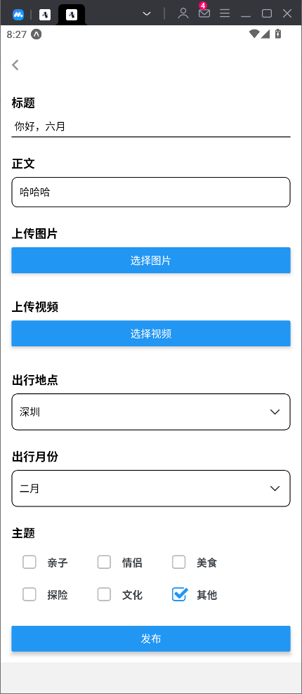
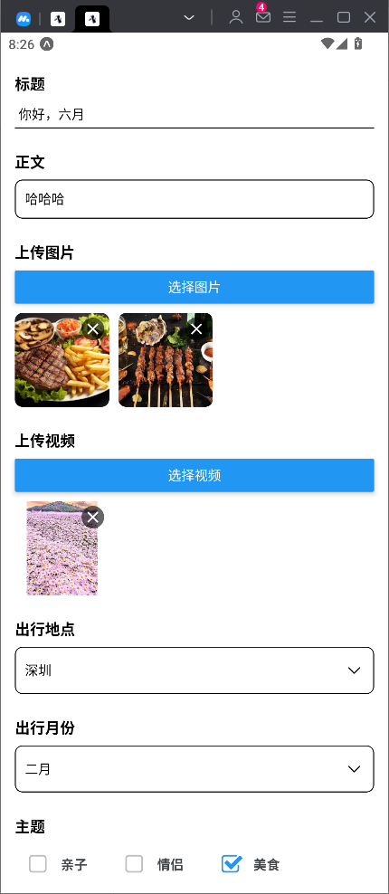
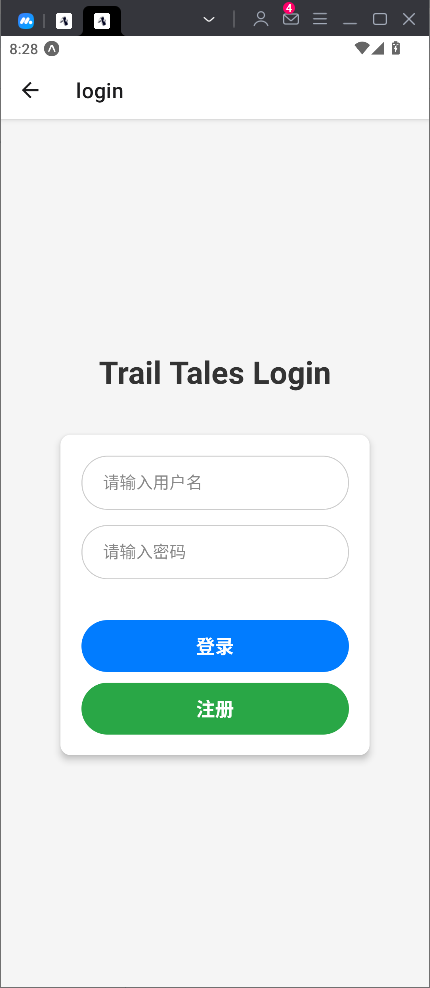
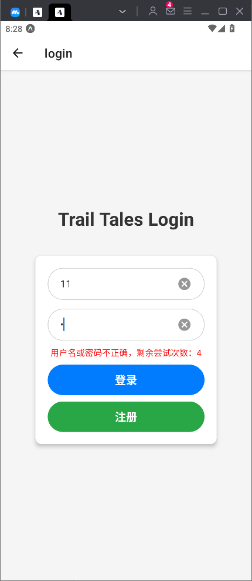
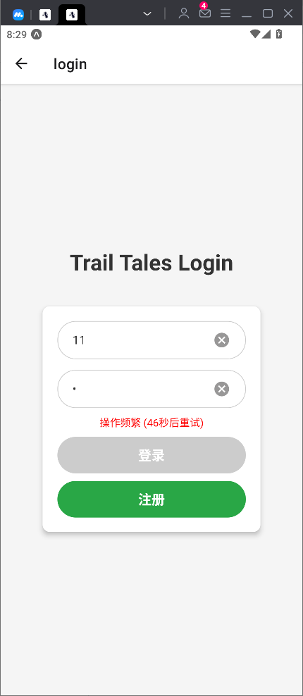
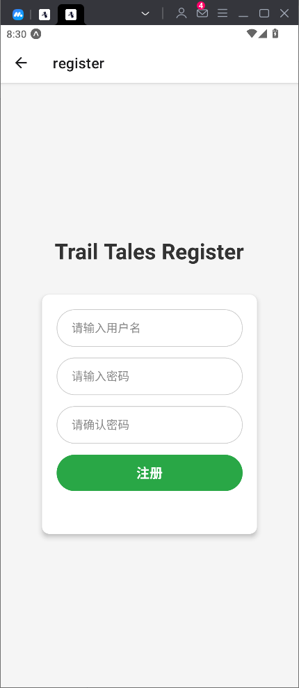
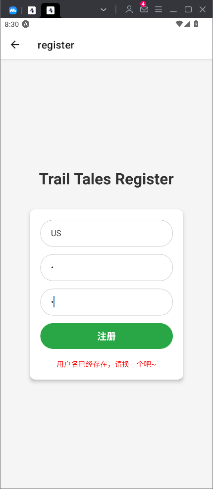
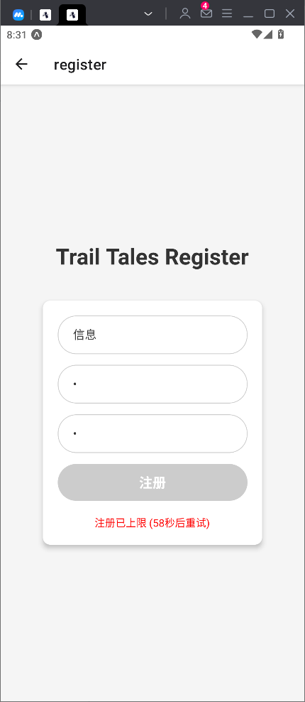

# 携程训练营大作业 -- Trail-Tales游记平台
## 项目介绍
项目分为游记发布、呈现的用户系统和内容合规检查的审核管理系统。其中对客用户使用的游记发布系统为一个移动端项目，可以在手机端发布游记以及查看、分享所有已成功发布的游记；审核管理系统为一个 PC 站点，不同角色可以对用户发布的游记做上线前的审核检查、删除等操作。<br><br>
仓库中的项目代码分为三个子模块，其中**移动端对应`trail-tales-app`**，**PC审核端对应`PC-management-system`**，**后端服务器及数据库搭建对应`back-end`**
## 环境配置
- ### 移动端<br>
  技术栈：React Native、Nodejs<br><br>
  1、 app使用expo沙盒环境搭建，初始化命令如下，在本项目中只需使用`npm install`命令安装依赖即可使用<br>
  ```
  npx create-expo-app trail-tales-app
  ```
  2、 app运行需要结合**Expo Go**软件来查看界面，可以选择真机以及模拟器两种方式打开，具体安装步骤可到官网上查看，下载时要与使用的expo沙盒环境的版本相对应，项目测试时使用的是Android SDK 53版本<br>
  
- ### PC审核端<br>
  技术栈：React Native、Nodejs<br><br>
  1、 审核端初始化命令如下，在本项目中只需使用`npm install`命令安装依赖即可使用<br>
  ```
  npx create-react-app PC-management-system
  ```
  2、 审核端登陆界面不提供注册功能，需要在后端运行`initManger.js`来初始化审核账号，建议初始化时创建超级管理员账号，在审核页面中会根据当前登录账号的权限提供不同的新建账号功能
- ### 后端<br>
  技术栈：Nodejs<br><br>
  后端服务器使用Nodejs搭建，数据库使用Mongodb数据库，项目运行时将其部署在本地，数据库的使用可以到官网上查看，前期需要在后端向数据库写入审核端所需的账号信息
  ```
  node initManger.js   // 写入管理员信息
  node server.js      // 运行后端服务器
  ```
## 页面设计
### app页面设计

- 首页（游记列表页）：该页面不验证用户的登录状态，通过审核的游记会以瀑布流的形式展示对应的游记卡片，点击卡片会进入到游记详情页，可以通过上方的搜索栏或主题挑选喜欢的游记展示<br>


- 游记详情页：该页面会显示游记的详细内容，包含发布游记的作者信息及游记内容，游记的视频和图片可以左右滑动显示，如果有视频资源则放在首位展示，点击视频可以全屏播放，点击图片可以放大显示，同时点击作者头像可以跳转至其主页，如果是本人发布的则跳转至个人主页<br>


- 我的游记页：该页面会先验证登录状态，未登录时会给出跳转登录界面的按钮，登录后显示用户的个人信息以及已发布的游记，游记位置会显示当前状态，可以对游记进行删除的操作，已通过审核的游记点击卡片会跳转至详情页，未审核和未通过的游记还可以进行编辑的操作，点击编辑直接跳转到游记发布页，并自动填充历史记录，点击退出登录按钮会弹出退出对话窗，此外也可以对用户头像进行修改<br>


- 游记发布页：用户登录后可以通过主页面的发布入口进入发布页，该页面可以通过相册上传图片及视频，其中图片最多上传六张，并且上传时对其进行了压缩处理，视频最多上传一个，提交时会进行校验<br>




- 登录界面：该页面实现了用户的登录功能，登录时账号重复、账号不存在、密码错误、账号或密码未输入均会弹出错误提示，同时在登录这里我们使用`rateLimit`对其增加了限流的功能，即每一段时间同一ip同一用户名登录失败的次数有限，达到一定失败的次数会提示操作频繁，并将登录按钮锁定，防止暴力破解密码<br>





- 注册界面：用户可以在这里注册自己的账户，会对密码进行二次校验，若用户已存在会提示，注册功能同样添加了限流功能，同一ip在一定时间段只能注册有限个账号<br>




### PC审核端页面设计
- 登录页面：该页面实现了用户的登录功能，账号不存在、密码错误、账号或密码未输入、不同意隐私条款均会弹出错误提示。同时隐私条款可以打开，输入密码时可以显示或者隐藏。


- 角色说明：角色共分为三个，权限依次从高到低，分别为超级管理员（在后端数据库中设置，拥有最高权限）、管理员（由超级管理员设置，可以设定审核人员）、审核人员（仅仅可以审核游记状态）。


- 审核列表：审核列表接受从后端传来的游记卡片的数据供PC端操作人员进行审核操作，审核状态共分为三种（待审核、已通过和未通过）、同时上方伴随选择审核状态与游记卡片的搜索功能。


- 用户管理列表：登录之后，超级管理员可以在此页面设定管理人员和审核人员，管理员可以在此页面可以设定审核人员，审核人员则没有此页面。该页面同时包含了编辑人员、删除人员和添加新人员的权限功能。<br>


- 卡片内容详情：在审核游记的具体内容时，由于游记卡片的范围较小，通常无法承载大量的内容。通过点击游记列表的图片，可以进入内容详情界面，里面包含了游客发布的内容标题、图片以及视频等，方便进行审核操作。


- 未通过理由填写框：PC端操作人员登录之后，点击未通过后需要填写理由，理由框下面包含一些常见的选项，最后点击提交按钮。


## 功能实现

### 移动端APP
- 数据存储：项目中app及pc端的数据使用mongodb数据库来管理，在后端使用`mongoose`库实现对数据库的操作
  
- 路由：使用expo初始化完毕所提供的路由规则，将页面全部存储在app文件夹中，以index开头的文件为路由入口，页面的路由路径根据其与app文件夹的相对路径来设置，导航功能主要使用`expo-router`来实现，具体内容可到其官方文档查看。

- 首页瀑布流卡片：将每个游记展示所使用的卡片封装为`TravelLogCard`组件，瀑布流的展示使用`WaterfallFlow`组件实现，当游记数量大于设置的基准数量时，使用`onEndReached`属性实现无限下拉刷新功能

- 发布页图片视频上传：使用`ImagePicker.launchImageLibraryAsync()`实现对图片和视频的选取，并用`mediaTypes`对选取的类型进行限定，图片的压缩通过设置`quality`实现，以FormData的格式上传给后端。
  
- 游记详情页图片和视频展示：将展示的内容封装为组件`mediaSlider`，根据图片资源的最大宽高比来等比例缩放全部图片，设置`contain`属性保证显示时不会丢失，使用`FlatList`组件渲染图片，设置`horizontal`属性为`true`实现水平滑动，`pagingEnabled`属性为`true`实现左右滑动时分页展示的效果。

- 登录、注册界面限流功能：在后端使用`rateLimit`设置限流的参数，根据后端是否响应状态码`429`来决定限流是否执行，其中登录使用`ip+username`来进行匹配，不计入登录成功的次数，防止暴力破解密码，注册使用`ip`来匹配，不计入注册失败的次数，防止恶意注册。在前端使用`AsyncStorage`持久化存储后端传来的限流时间`retryAfter`，然后使用计时器动态显示剩余限流时间。

### PC端
- 数据存储：项目中app及pc端的数据使用mongodb数据库来管理，在后端使用`mongoose`库实现对数据库的操作

- 路由：使用`react-router-dom`。支持多个页面：`/travelLogList`：旅行日志列表页面，`/permissionList`：权限管理页面，`/userList`：用户管理页面，`/logDetail/:logId`：日志详情页面。

- 在登录界面，用户输入用户名和密码进行登录。登录成功后，将用户信息保存到 `cookie` 中，并调用 `App.js`中的 `handleLogin` 回调函数.登录失败时，显示错误提示。同时该界面使用 `Modal`提供一个隐私条款的弹出框,用户必须同意隐私条款才能登录.

- 管理后台布局使用 `Ant Design` 的 `Layout` 组件实现侧边栏`Sider`、头部`Header`和内容区域`Content`。侧边栏显示菜单，头部显示用户信息和退出登录按钮，内容区域根据路由显示不同的页面。同时根据用户角色（如超级管理员、管理员、审核人员）显示不同的菜单和页面。用户可以退出登录，清除 cookie 并返回登录页面

- 在审核列表界面，使用`TravelLogList`和`TravelLogCard`共同实现了一个旅行日志管理系统的前端功能，`TravelLogList` 组件负责展示旅行日志的列表，并提供搜索`onSearch`、筛选`handleSelectState`、分页`handlePageChange`等功能。`TravelLogList`使用`map`渲染多个`TravelLogCard`组件，并且提供回调函数（如 `handleStateChange` 和 `handleDelete`）以便于`TravelLogCard`组件更新日志状态或删除日志。`TravelLogCard`组件负责展示单条旅行日志的详细信息，并提供审核操作（通过`handlePassState`、拒绝`handleForbiddenState`、删除`handleDelete`等），如果选择“拒绝”，弹出抽屉组件，用户可以填写拒绝理由`handleSubmitInstruction`。

- 在角色说明页面提供了对于不同权限的角色的介绍

- 在用户权限设置页面，用户可以通过搜索框输入用户名动态搜索不同的用户`handleSearchChange`。超级管理员可以编辑`handleEditRole`和删除`handleDelete`用户的角色（如管理员或审核人员），并且提供一个抽屉组件，超级管理员可以通过表单添加新用户`onFinish`。管理员只可以管理审核人员，审核人员只可以进行审核操作


